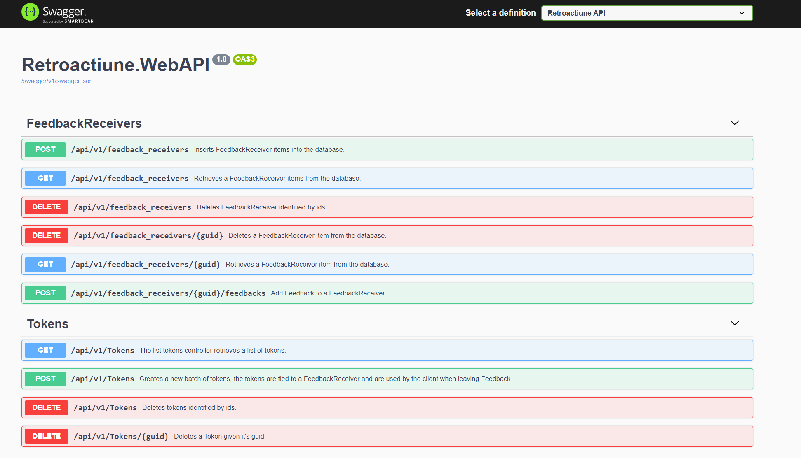

# Introduction

   
  



Retroactiune is a project for managing Feedback. It works in the following way,
an Admin to creates FeedbackReceivers that will receive Feedback. Then it will generate Tokens that can be 
distributed to the users. A Tokens is bound to a single FeedbackReceiver and it's a one time use for giving Feedback.

The given Feedback is anonymous by design.

## Tech Stack

The project uses [ASP .Net Core 3.1](https://docs.microsoft.com/en-us/aspnet/core/) and [MongoDB](https://www.mongodb.com/).

```bash
dotnet --version
3.1.407
```

## Architecture

Example deployment architecture which uses [Prometheus](https://prometheus.io/) & [Grafana](https://grafana.com/) for monitoring, [Auth0](https://auth0.com/) as a authorization server
and [Sentry](https://sentry.io/welcome/) for error reporting.


The application code is organized using the [Clean Architecture](https://docs.microsoft.com/en-us/dotnet/architecture/modern-web-apps-azure/common-web-application-architectures#clean-architecture) approach.


## Developing

To install the dependencies run `dotnet restore`.

To run the project run

```bash
dotnet run --project .\Retroactiune.WebAPI\
```

To run unit and integration tests run:

_Note: [Docker](https://www.docker.com/) and [Docker-Compose](https://docs.docker.com/compose/) are needed to bring up the dependent services, see `docker-compose.yaml`._

```bash
docker-compose up -d
dotnet test
```